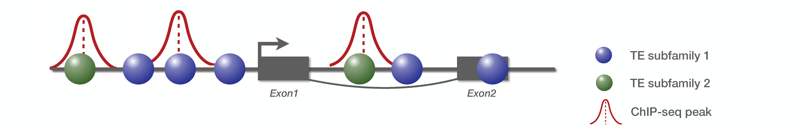
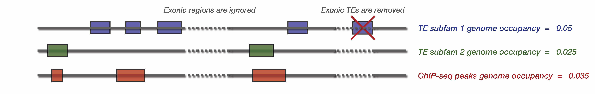
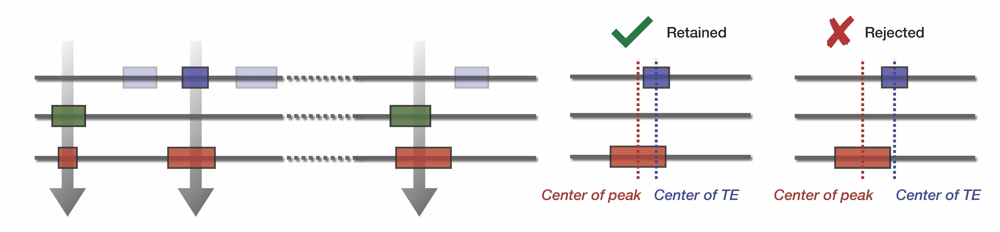

.. pyTEnrich documentation master file, created by
   sphinx-quickstart on Wed Dec 30 11:29:02 2020.
   You can adapt this file completely to your liking, but it should at least
   contain the root `toctree` directive.

.. toctree::
   :maxdepth: 2
   :caption: Contents: 
   
   usage/installation.rst
   usage/execution.rst
   usage/output.rst
   usage/detailmethods.rst
   usage/genome_subset.rst
   usage/otherspecies.rst
   usage/analysis_ex.rst
   source/pyTEnrich.rst
   
Overview of the methods
=======================

**pyTEnrich** compare the overlap between input bed files and transposable elements families, using a binomial model to compare the observed overlap to the expected one. The expected overlap is derived from genome occupancy of TE families and compared to the observed overlap to highlight potential over-representation of TE families / subfamilies.

**Example** 

We consider a small genome with one gene composed of two exons, and two TE families. There is 3 ChIP-seq peaks detected :

**Step 1 : Compute genome occupancy**

First, pyTEnrich compute genome occupancy for TE families and input bed files. Genome occupancy is defined as the total number of base pair (bp) spanned by the TE family, divided by the genome size. It is therefore a ratio of genome occupancy. 

Note that TE genome occupancy are pre-computed for the provided TE database. If another TE database is given, or if a genome subset is provided (explained below), it will be re-computed (takes a few minutes). 

**Step 2 : Intersect TE and Input bed files and count overlap**

Using `Bedtools intersect <https://bedtools.readthedocs.io/en/latest/content/tools/intersect.html>`_, we compute a stringent overlap between input bed files and TE database. The observed overlap can then be compared with the expected overlap.

**Step 3 : Compute the enrichment of TE subfamily / family**

The enrichment is performed using a binomial test. The binomial test is an exact test of the statistical significance of deviations from a theoretically expected distribution, considering two possible outcome. In our case : TE overlap with peak (success) or do not overlap (failure). We can calculate the probability to have at least k success by suming up probabilities, from k success to n success: 

.. math::
    P(B >= k) = 1 - P(B < k) = 1 - \sum_{i=0}^{k-1} \binom{n}{i} p^i (1 - p)^{n - i}

This probability is our p-value of having at least k success, given a probability p for the overlap, and n trials. The p-values obtained above are then adjusted with the Benjamin-Hochsberg method to correct for multiple testing.

:ref:`detailmethods`
