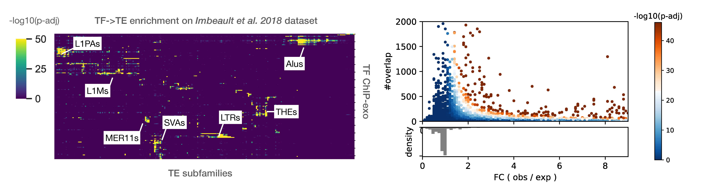

.. pyTEnrich documentation master file, created by
   sphinx-quickstart on Wed Dec 30 11:29:02 2020.
   You can adapt this file completely to your liking, but it should at least
   contain the root `toctree` directive.

Welcome to pyTEnrich's documentation!
=====================================

A code for to compute statistical enrichment of transposable elements
on a group of bed files. Code written by Alexandre Coudray from the
laboratory of Virology and Genetics at the EPFL in 2019.

.. toctree::
   :maxdepth: 2
   :caption: Contents: 
   
   usage/installation.rst
   usage/execution.rst
   usage/genome_subset.rst
   usage/otherspecies.rst
    
`source code on github <https://c4science.ch/diffusion/11057>`_

Overview of the methods
=======================

To compute the statistical enrichment, pyTEnrich compare the overlap between input bed files and transposable elements families. pyTEnrich uses a binomial model to compare the observed overlap to the expected one, given a probability computed from the genome occupancy of TE families.

**Example** 

We consider a small genome with one gene composed of two exons, and two TE families. There is 3 ChIP-seq peaks detected :

.. image:: images/fig1.png

**Step 1 : Compute genome occupancy**

First, pyTEnrich compute genome occupancy for TE families and input bed files. Genome occupancy is defined as the total number of base pair (bp) spanned by the TE family, divided by the genome size. It is therefore a ratio of genome occupancy. 

.. image:: images/fig2.jpg

Note that TE genome occupancy are pre-computed for the provided TE database. If another TE database is given, or if a genome subset is provided (explained below), it will be re-computed (takes a few minutes). 

**Step 2 : Intersect TE and Input bed files and count overlap**

Using `Bedtools intersect <https://bedtools.readthedocs.io/en/latest/content/tools/intersect.html>`_, we compute a stringent overlap between input bed files and TE database. The observed overlap can then be compared with the expected overlap.

.. image:: images/fig3.jpg

**Step 3 : Compute the enrichment of TE subfamily / family**

The enrichment is performed using a binomial test. The binomial test is an exact test of the statistical significance of deviations from a theoretically expected distribution, considering two possible outcome. In our case : TE overlap with peak (success) or do not overlap (failure). The statistical hypothesis is :

.. math::
    {\displaystyle H_{0}:p_{obs} =p_{exp}}

where :math:`p_{exp}` is the ratio of genome occupancy of each TE family. :math:`p_{exp}` is therefore the expectation based on genome occupancy, and :math:`p_{obs}` is the observed overlap. Since the probability of having k successes from n trials is given by

.. math::
    P(B = k) = \binom{n}{k} p^k (1 - p)^{n - k}

We can calculate the probability to have at least k success by suming up probabilities, from k success to n success. As often the number of success is on the low edge, we prefer to compute the inverse probability :

.. math::
    P(B >= k) = 1 - P(B < k) = 1 - \sum_{i=0}^{k-1} \binom{n}{i} p^i (1 - p)^{n - i}

This probability is our p-value of having at least k success, given a probability p for the overlap, and n trials. The p-values obtained above are then adjusted with the Benjamin-Hochsberg method to correct for multiple testing.

**Enrichment analysis example on Imbeault et al. dataset**

Using the abovementionned approach, TE enrichment analysis was performed for 321 ChIP-exo from `Imbeault et al. 2018 dataset <https://www.nature.com/articles/nature21683>`_.

