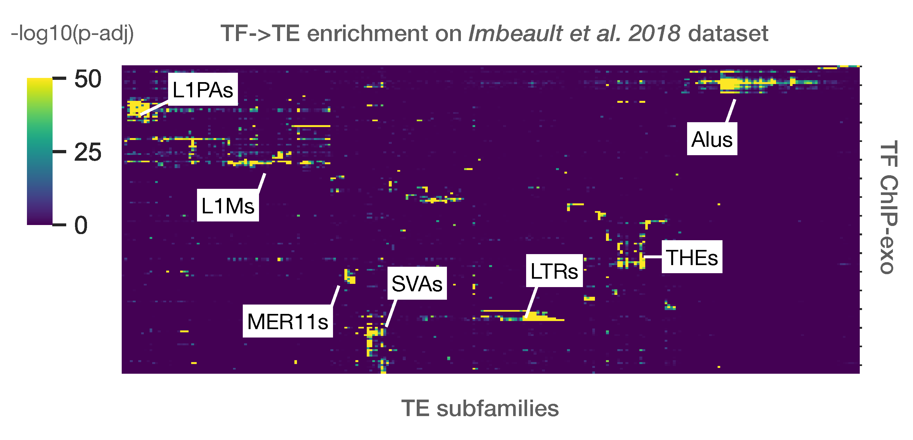
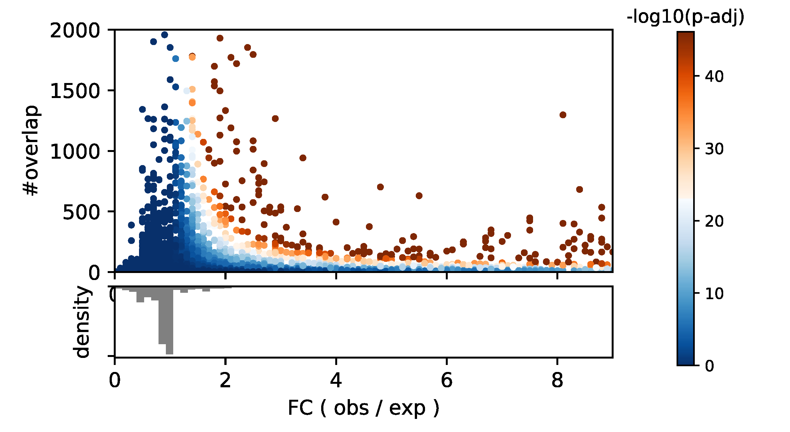

Analysis example
________________

**Enrichment analysis example on Imbeault et al. dataset**

Using the abovementionned approach, TE enrichment analysis was performed for 321 ChIP-exo from `Imbeault et al. 2018 dataset <https://www.nature.com/articles/nature21683>`_.

One of the typical analysis is to represent all TE subfamilies as :math:`-log_{10}(p-value)` on a heatmap, against all input samples (bed files). Here, a heatmap showing the strongest subfamily enrichment in `Imbeault et al. 2018 <https://www.nature.com/articles/nature21683>`_.

One of the values that *pyTEnrich* typically returns is a fold change between observed and expected (). It is interseting to observed below, if we merged results from 321 ChIP-exo samples from `Imbeault et al. 2018 <https://www.nature.com/articles/nature21683>`_., the relation between the size of the overlap (#overlap), the fold change (x-axis) and the p-values (color). 

It is usually prefered to use a threshold on the fold change on top of the p-value, to select the significant over-representations, in order to limit biases coming from sample size. Indeed large N tend to decrease p-values, which is limited by the adjustment with Benjamin-Hochsberg method but not eradicated.
