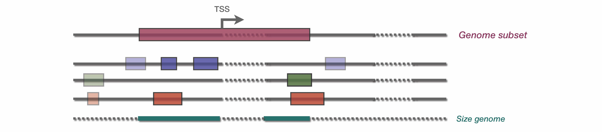

Using a genome subset
_____________________

A genome subset can be given as an optional parameter to compute the enrichment only on a subset of the genome. For instance, we might interest ourself only on the neighborhood of transcription start sites (TSS). Therefore, a bed file containing these regions can be provided through the **--genome_subset** parameter.

The genome subset will therefore induce a subset of TE database, and a subset of each input bed files. Then, the genome size is re-calculated based on the total number of base pair included in genome_subset bed file.
